# アクティビティ図
- [アクティビティ図](#アクティビティ図)
  - [【PRTP001】トップページアクセス](#prtp001トップページアクセス)
  - [【PRPL001】プレイヤーサイトアクセス](#prpl001プレイヤーサイトアクセス)
  - [【PRPL301】再開ボタン押下](#prpl301再開ボタン押下)
  - [【PRMT001】モニターサイトアクセス](#prmt001モニターサイトアクセス)
  - [【PRGM001】ゲームマスターサイトアクセス](#prgm001ゲームマスターサイトアクセス)
  - [【PRGM002】新規ゲームボタン押下](#prgm002新規ゲームボタン押下)
  - [【PRGM301】ゲーム再開ボタン押下](#prgm301ゲーム再開ボタン押下)
  - [【PRGM003】各モードボタン押下](#prgm003各モードボタン押下)
  - [【PRAL001】募集開始ボタン押下](#pral001募集開始ボタン押下)
  - [【PRPL002】参加ボタン押下](#prpl002参加ボタン押下)
  - [【PRPL003】プレイヤー登録画面次へボタン押下](#prpl003プレイヤー登録画面次へボタン押下)
  - [【PRPL004】ゲームへ参加ボタン押下](#prpl004ゲームへ参加ボタン押下)
  - [【PRAL002】受付を締め切るボタン押下](#pral002受付を締め切るボタン押下)
  - [【PRGM004】ゲーム設定画面次へボタン押下](#prgm004ゲーム設定画面次へボタン押下)
  - [【PRAL003】ゲーム開始ボタン押下](#pral003ゲーム開始ボタン押下)
  - [【PRAL004】役職決定画面遷移](#pral004役職決定画面遷移)

## 【PRTP001】トップページアクセス

- 普通はアクセスしない

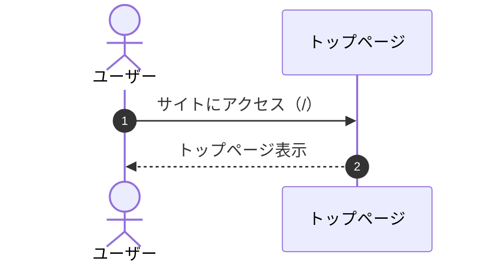
```mermaid
sequenceDiagram
    %% 定義
    actor user as ユーザー
    participant siteTop as トップページ
    
    %% フロー記述
    autonumber
    user ->> siteTop: サイトにアクセス（/）
    siteTop -->> user: トップページ表示
```

## 【PRPL001】プレイヤーサイトアクセス

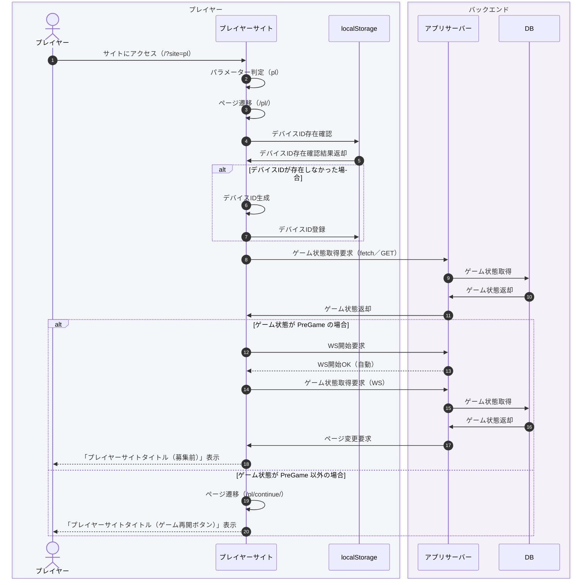
```mermaid
sequenceDiagram
    %% 定義
    box rgba(202, 237, 255, 0.1) プレイヤー
        actor pl as プレイヤー
        participant pls as プレイヤーサイト
        participant plls as localStorage
    end
    box rgba(216, 180, 248, 0.1) バックエンド
        participant sv as アプリサーバー
        participant db as DB
    end
    
    %% フロー記述
    autonumber
    pl ->> pls: サイトにアクセス（/?site=pl）
    pls ->> pls: パラメーター判定（pl）
    pls ->> pls: ページ遷移（/pl/）
    pls ->> plls: デバイスID存在確認
    plls ->> pls: デバイスID存在確認結果返却
    alt デバイスIDが存在しなかった場合
        pls ->> pls: デバイスID生成
        pls ->> plls: デバイスID登録
    end
    pls ->> sv: ゲーム状態取得要求（fetch／GET）
    sv ->> db: ゲーム状態取得
    db ->> sv: ゲーム状態返却
    sv ->> pls: ゲーム状態返却
    alt ゲーム状態が PreGame の場合
        pls ->> sv: WS開始要求
        sv -->> pls: WS開始OK（自動）
        pls ->> sv: ゲーム状態取得要求（WS）
        sv ->> db: ゲーム状態取得
        db ->> sv: ゲーム状態返却
        sv ->> pls: ページ変更要求
        pls -->> pl: 「プレイヤーサイトタイトル（募集前）」表示
    else ゲーム状態が PreGame 以外の場合
        pls ->> pls: ページ遷移（/pl/continue/）
        pls -->> pl: 「プレイヤーサイトタイトル（ゲーム再開ボタン）」表示
    end
```

## 【PRPL301】再開ボタン押下

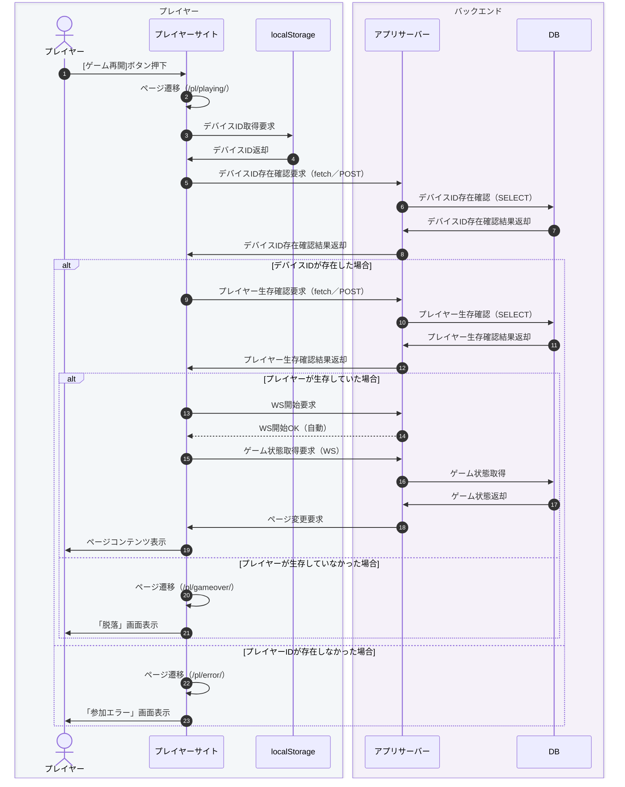
```mermaid
sequenceDiagram
    %% 定義
    box rgba(202, 237, 255, 0.1) プレイヤー
        actor pl as プレイヤー
        participant pls as プレイヤーサイト
        participant plls as localStorage
    end
    box rgba(216, 180, 248, 0.1) バックエンド
        participant sv as アプリサーバー
        participant db as DB
    end
    
    %% フロー記述
    autonumber
    pl ->> pls: [ゲーム再開]ボタン押下
    pls ->> pls: ページ遷移（/pl/playing/）
    pls ->> plls: デバイスID取得要求
    plls ->> pls: デバイスID返却
    pls ->> sv: デバイスID存在確認要求（fetch／POST）
    sv ->> db: デバイスID存在確認（SELECT）
    db ->> sv: デバイスID存在確認結果返却
    sv ->> pls: デバイスID存在確認結果返却
    alt デバイスIDが存在した場合
        pls ->> sv: プレイヤー生存確認要求（fetch／POST）
        sv ->> db: プレイヤー生存確認（SELECT）
        db ->> sv: プレイヤー生存確認結果返却
        sv ->> pls: プレイヤー生存確認結果返却
        alt プレイヤーが生存していた場合
            pls ->> sv: WS開始要求
            sv -->> pls: WS開始OK（自動）
            pls ->> sv: ゲーム状態取得要求（WS）
            sv ->> db: ゲーム状態取得
            db ->> sv: ゲーム状態返却
            sv ->> pls: ページ変更要求
            pls ->> pl: ページコンテンツ表示
        else プレイヤーが生存していなかった場合
            pls ->> pls: ページ遷移（/pl/gameover/）
            pls ->> pl: 「脱落」画面表示
        end
    else プレイヤーIDが存在しなかった場合
        pls ->> pls: ページ遷移（/pl/error/）
        pls ->> pl: 「参加エラー」画面表示
    end
```

## 【PRMT001】モニターサイトアクセス

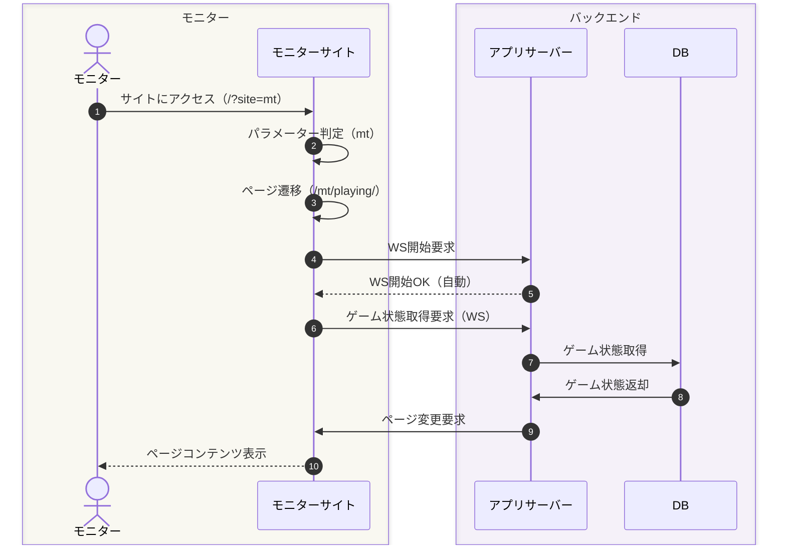
```mermaid
sequenceDiagram
    %% 定義
    box rgba(251, 240, 178, 0.1) モニター
        actor mt as モニター
        participant mts as モニターサイト
    end
    box rgba(216, 180, 248, 0.1) バックエンド
        participant sv as アプリサーバー
        participant db as DB
    end
    
    %% フロー記述
    autonumber
    mt ->> mts: サイトにアクセス（/?site=mt）
    mts ->> mts: パラメーター判定（mt）
    mts ->> mts: ページ遷移（/mt/playing/）
    mts ->> sv: WS開始要求
    sv -->> mts: WS開始OK（自動）
    mts ->> sv: ゲーム状態取得要求（WS）
    sv ->> db: ゲーム状態取得
    db ->> sv: ゲーム状態返却
    sv ->> mts: ページ変更要求
    mts -->> mt: ページコンテンツ表示
```

## 【PRGM001】ゲームマスターサイトアクセス

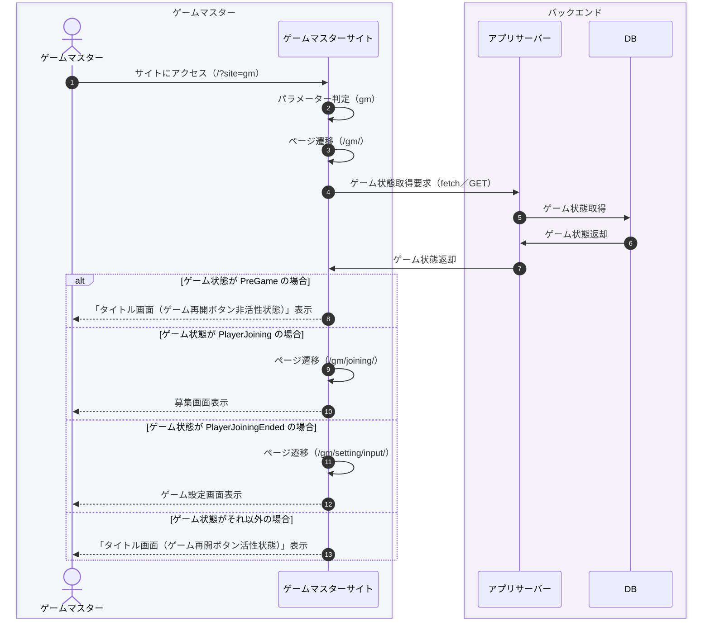
```mermaid
sequenceDiagram
    %% 定義
    box rgba(202, 237, 255, 0.1) ゲームマスター
        actor gm as ゲームマスター
        participant gms as ゲームマスターサイト
    end
    box rgba(216, 180, 248, 0.1) バックエンド
        participant sv as アプリサーバー
        participant db as DB
    end
    
    %% フロー記述
    autonumber
    gm ->> gms: サイトにアクセス（/?site=gm）
    gms ->> gms: パラメーター判定（gm）
    gms ->> gms: ページ遷移（/gm/）
    gms ->> sv: ゲーム状態取得要求（fetch／GET）
    sv ->> db: ゲーム状態取得
    db ->> sv: ゲーム状態返却
    sv ->> gms: ゲーム状態返却
    alt ゲーム状態が PreGame の場合
        gms -->> gm: 「タイトル画面（ゲーム再開ボタン非活性状態）」表示
    else ゲーム状態が PlayerJoining の場合
        gms ->> gms: ページ遷移（/gm/joining/）
        gms -->> gm: 募集画面表示
    else ゲーム状態が PlayerJoiningEnded の場合
        gms ->> gms: ページ遷移（/gm/setting/input/）
        gms -->> gm: ゲーム設定画面表示
    else ゲーム状態がそれ以外の場合
        gms -->> gm: 「タイトル画面（ゲーム再開ボタン活性状態）」表示
    end
```

## 【PRGM002】新規ゲームボタン押下

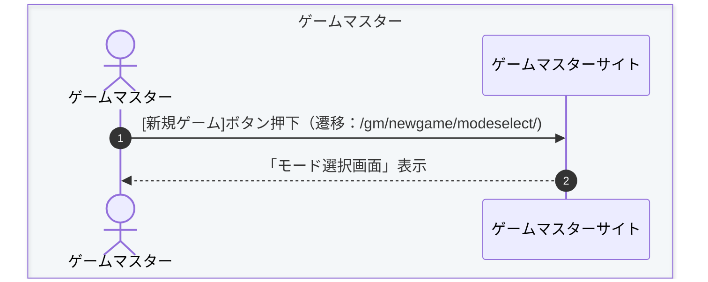
```mermaid
sequenceDiagram
    %% 定義
    box rgba(202, 237, 255, 0.1) ゲームマスター
        actor gm as ゲームマスター
        participant gms as ゲームマスターサイト
    end
    
    %% フロー記述
    autonumber
    gm ->> gms: [新規ゲーム]ボタン押下（遷移：/gm/newgame/modeselect/)
    gms -->> gm: 「モード選択画面」表示
```

## 【PRGM301】ゲーム再開ボタン押下

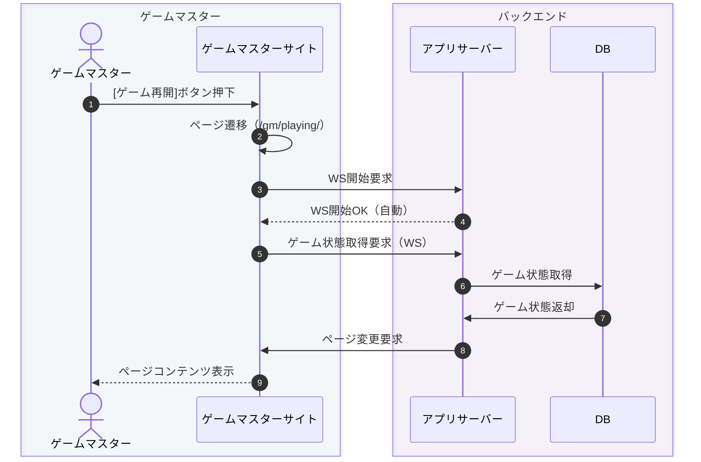
```mermaid
sequenceDiagram
    %% 定義
    box rgba(202, 237, 255, 0.1) ゲームマスター
        actor gm as ゲームマスター
        participant gms as ゲームマスターサイト
    end
    box rgba(216, 180, 248, 0.1) バックエンド
        participant sv as アプリサーバー
        participant db as DB
    end
    
    %% フロー記述
    autonumber
    gm ->> gms: [ゲーム再開]ボタン押下
    gms ->> gms: ページ遷移（/gm/playing/）
    gms ->> sv: WS開始要求
    sv -->> gms: WS開始OK（自動）
    gms ->> sv: ゲーム状態取得要求（WS）
    sv ->> db: ゲーム状態取得
    db ->> sv: ゲーム状態返却
    sv ->> gms: ページ変更要求
    gms -->> gm: ページコンテンツ表示
```

## 【PRGM003】各モードボタン押下

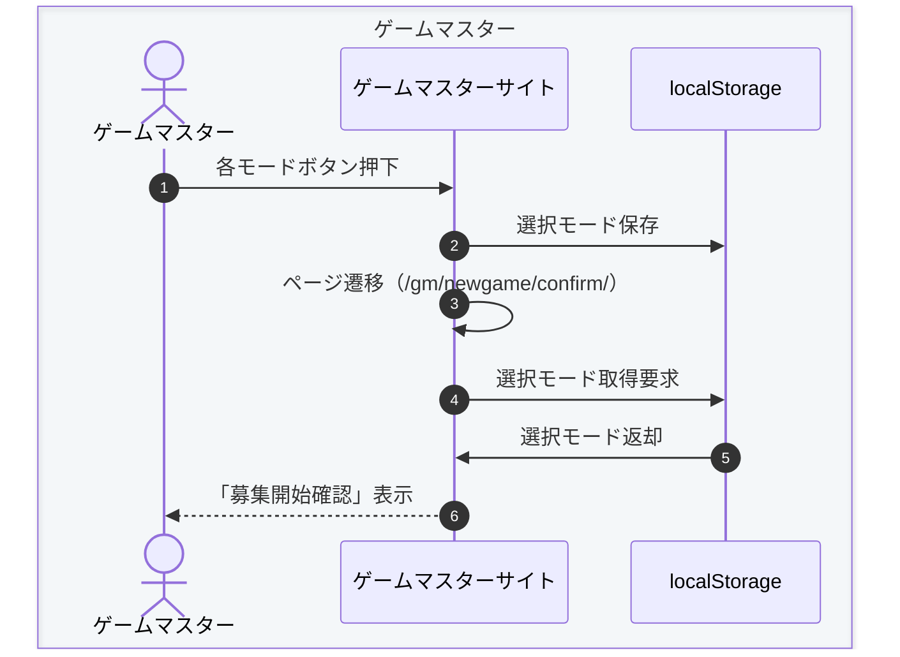
```mermaid
sequenceDiagram
    %% 定義
    box rgba(202, 237, 255, 0.1) ゲームマスター
        actor gm as ゲームマスター
        participant gms as ゲームマスターサイト
        participant gmls as localStorage
    end
    
    %% フロー記述
    autonumber
    gm ->> gms: 各モードボタン押下
    gms ->> gmls: 選択モード保存
    gms ->> gms: ページ遷移（/gm/newgame/confirm/）
    gms ->> gmls: 選択モード取得要求
    gmls ->> gms: 選択モード返却
    gms -->> gm: 「募集開始確認」表示
```

## 【PRAL001】募集開始ボタン押下

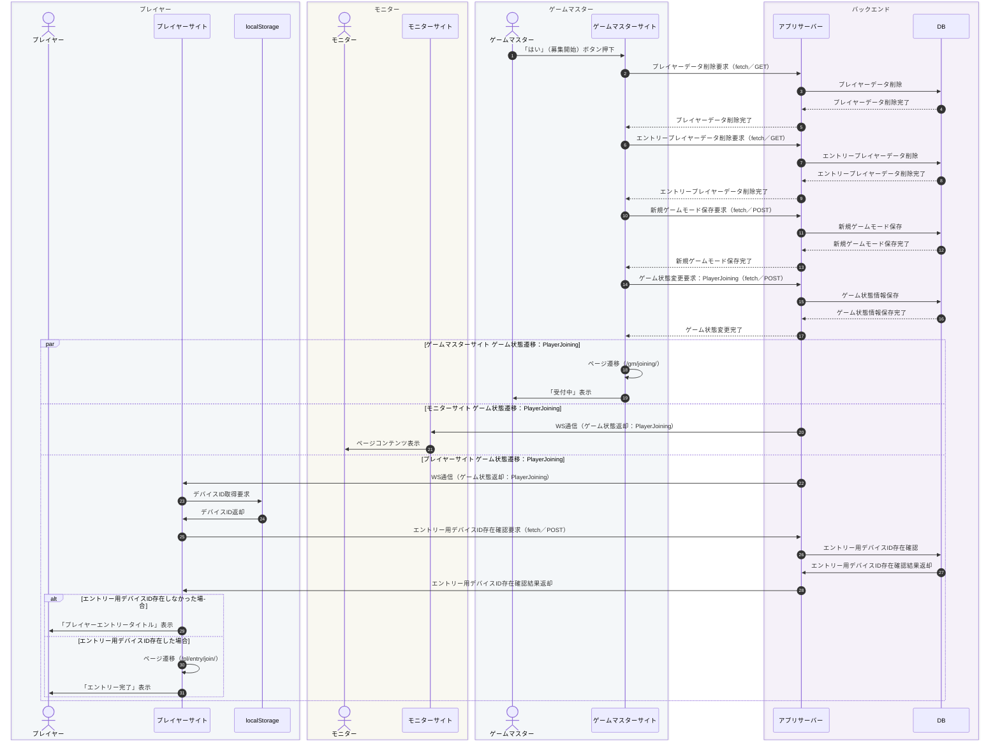
```mermaid
sequenceDiagram
    %% 定義
    box rgba(202, 237, 255, 0.1) プレイヤー
        actor pl as プレイヤー
        participant pls as プレイヤーサイト
        participant plls as localStorage
    end
    box rgba(251, 240, 178, 0.1) モニター
        actor mt as モニター
        participant mts as モニターサイト
    end
    box rgba(202, 237, 255, 0.1) ゲームマスター
        actor gm as ゲームマスター
        participant gms as ゲームマスターサイト
    end
    box rgba(216, 180, 248, 0.1) バックエンド
        participant sv as アプリサーバー
        participant db as DB
    end
    
    %% フロー記述
    autonumber
    gm ->> gms: 「はい」（募集開始）ボタン押下
    gms ->> sv: プレイヤーデータ削除要求（fetch／GET）
    sv ->> db: プレイヤーデータ削除
    db -->> sv: プレイヤーデータ削除完了
    sv -->> gms: プレイヤーデータ削除完了
    gms ->> sv: エントリープレイヤーデータ削除要求（fetch／GET）
    sv ->> db: エントリープレイヤーデータ削除
    db -->> sv: エントリープレイヤーデータ削除完了
    sv -->> gms: エントリープレイヤーデータ削除完了
    gms ->> sv: 新規ゲームモード保存要求（fetch／POST）
    sv ->> db: 新規ゲームモード保存
    db -->> sv: 新規ゲームモード保存完了
    sv -->> gms: 新規ゲームモード保存完了
    gms ->> sv: ゲーム状態変更要求：PlayerJoining（fetch／POST）
    sv ->> db: ゲーム状態情報保存
    db -->> sv: ゲーム状態情報保存完了
    sv -->> gms: ゲーム状態変更完了
    par ゲームマスターサイト ゲーム状態遷移：PlayerJoining
        gms ->> gms: ページ遷移（/gm/joining/）
        gms ->> gm: 「受付中」表示
    and モニターサイト ゲーム状態遷移：PlayerJoining
        sv ->> mts: WS通信（ゲーム状態返却：PlayerJoining）
        mts ->> mt: ページコンテンツ表示
    and プレイヤーサイト ゲーム状態遷移：PlayerJoining
        sv ->> pls: WS通信（ゲーム状態返却：PlayerJoining）
        pls ->> plls: デバイスID取得要求
        plls ->> pls: デバイスID返却
        pls ->> sv: エントリー用デバイスID存在確認要求（fetch／POST）
        sv ->> db: エントリー用デバイスID存在確認
        db ->> sv: エントリー用デバイスID存在確認結果返却
        sv ->> pls: エントリー用デバイスID存在確認結果返却
        alt エントリー用デバイスID存在しなかった場合
            pls ->> pl: 「プレイヤーエントリータイトル」表示
        else エントリー用デバイスID存在した場合
            pls ->> pls: ページ遷移（/pl/entry/join/）
            pls ->> pl: 「エントリー完了」表示
        end
    end
```

## 【PRPL002】参加ボタン押下

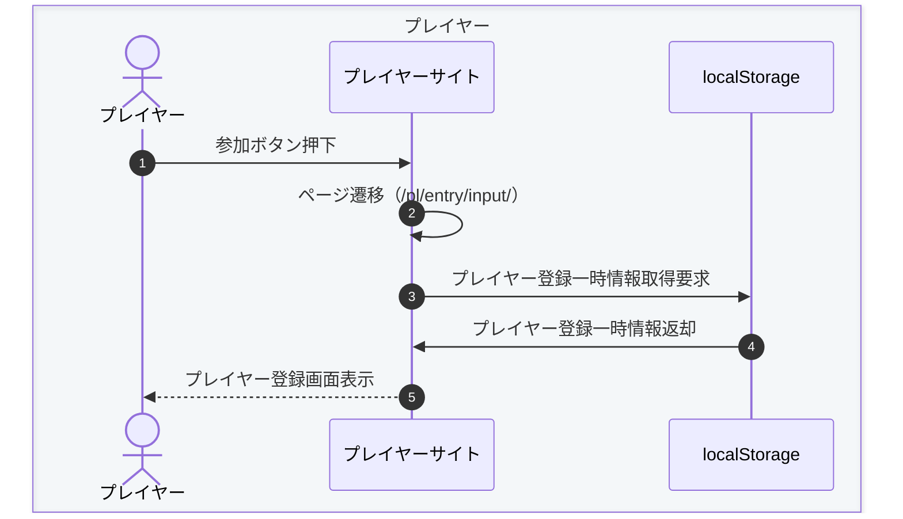
```mermaid
sequenceDiagram
    %% 定義
    box rgba(202, 237, 255, 0.1) プレイヤー
        actor pl as プレイヤー
        participant pls as プレイヤーサイト
        participant plls as localStorage
    end
    
    %% フロー記述
    autonumber
    pl ->> pls: 参加ボタン押下
    pls ->> pls: ページ遷移（/pl/entry/input/）
    pls ->> plls: プレイヤー登録一時情報取得要求
    plls ->> pls: プレイヤー登録一時情報返却
    pls -->> pl: プレイヤー登録画面表示
```

## 【PRPL003】プレイヤー登録画面次へボタン押下

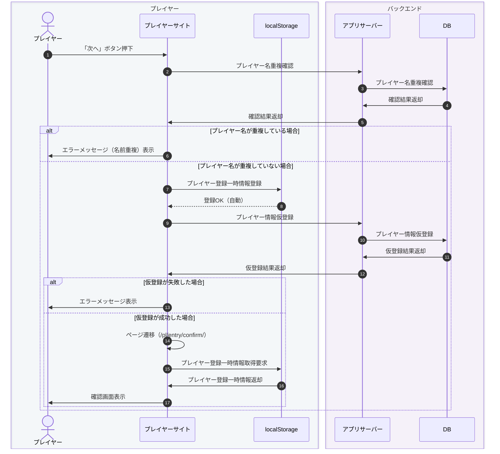
```mermaid
sequenceDiagram
    %% 定義
    box rgba(202, 237, 255, 0.1) プレイヤー
        actor pl as プレイヤー
        participant pls as プレイヤーサイト
        participant plls as localStorage
    end
    box rgba(216, 180, 248, 0.1) バックエンド
        participant sv as アプリサーバー
        participant db as DB
    end
    
    %% フロー記述
    autonumber
    pl ->> pls: 「次へ」ボタン押下
    pls ->> sv: プレイヤー名重複確認
    sv ->> db: プレイヤー名重複確認
    db ->> sv: 確認結果返却
    sv ->> pls: 確認結果返却
    alt プレイヤー名が重複している場合
        pls ->> pl: エラーメッセージ（名前重複）表示
    else プレイヤー名が重複していない場合
        pls ->> plls: プレイヤー登録一時情報登録
        plls -->> pls: 登録OK（自動）
        pls ->> sv: プレイヤー情報仮登録
        sv ->> db: プレイヤー情報仮登録
        db ->> sv: 仮登録結果返却
        sv ->> pls: 仮登録結果返却
        alt 仮登録が失敗した場合
            pls ->> pl: エラーメッセージ表示
        else 仮登録が成功した場合
            pls ->> pls: ページ遷移（/pl/entry/confirm/）
            pls ->> plls: プレイヤー登録一時情報取得要求
            plls ->> pls: プレイヤー登録一時情報返却
            pls ->> pl: 確認画面表示
        end
    end
```

## 【PRPL004】ゲームへ参加ボタン押下

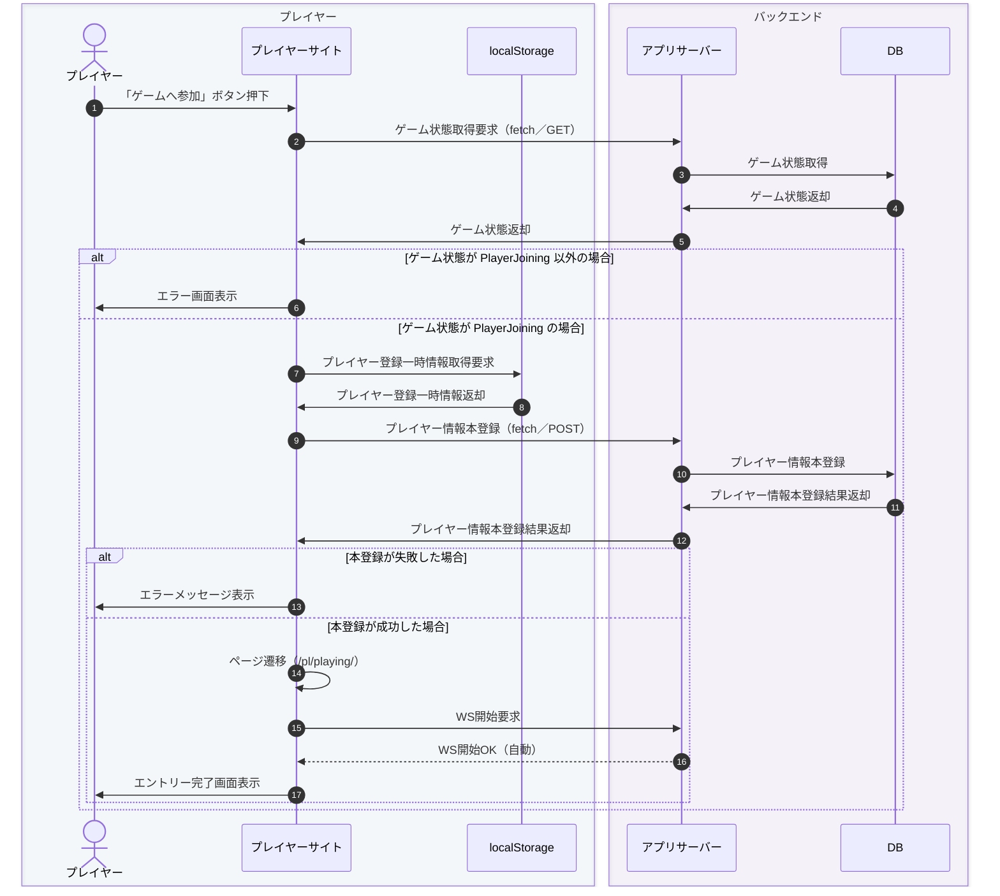
```mermaid
sequenceDiagram
    %% 定義
    box rgba(202, 237, 255, 0.1) プレイヤー
        actor pl as プレイヤー
        participant pls as プレイヤーサイト
        participant plls as localStorage
    end
    box rgba(216, 180, 248, 0.1) バックエンド
        participant sv as アプリサーバー
        participant db as DB
    end
    
    %% フロー記述
    autonumber
    pl ->> pls: 「ゲームへ参加」ボタン押下
    pls ->> sv: ゲーム状態取得要求（fetch／GET）
    sv ->> db: ゲーム状態取得
    db ->> sv: ゲーム状態返却
    sv ->> pls: ゲーム状態返却
    alt ゲーム状態が PlayerJoining 以外の場合
        pls ->> pl: エラー画面表示
    else ゲーム状態が PlayerJoining の場合
        pls ->> plls: プレイヤー登録一時情報取得要求
        plls ->> pls: プレイヤー登録一時情報返却
        pls ->> sv: プレイヤー情報本登録（fetch／POST）
        sv ->> db: プレイヤー情報本登録
        db ->> sv: プレイヤー情報本登録結果返却
        sv ->> pls: プレイヤー情報本登録結果返却
        alt 本登録が失敗した場合
            pls ->> pl: エラーメッセージ表示
        else 本登録が成功した場合
            pls ->> pls: ページ遷移（/pl/playing/）
            pls ->> sv: WS開始要求
            sv -->> pls: WS開始OK（自動）
            pls ->> pl: エントリー完了画面表示
        end
    end
```

## 【PRAL002】受付を締め切るボタン押下

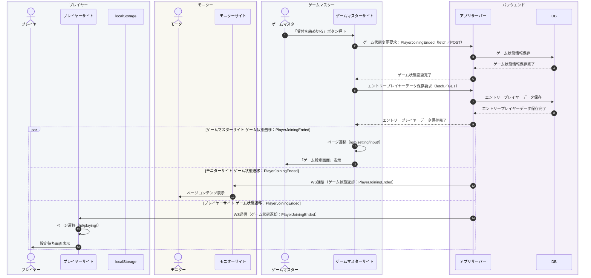
```mermaid
sequenceDiagram
    %% 定義
    box rgba(202, 237, 255, 0.1) プレイヤー
        actor pl as プレイヤー
        participant pls as プレイヤーサイト
        participant plls as localStorage
    end
    box rgba(251, 240, 178, 0.1) モニター
        actor mt as モニター
        participant mts as モニターサイト
    end
    box rgba(202, 237, 255, 0.1) ゲームマスター
        actor gm as ゲームマスター
        participant gms as ゲームマスターサイト
    end
    box rgba(216, 180, 248, 0.1) バックエンド
        participant sv as アプリサーバー
        participant db as DB
    end
    
    %% フロー記述
    autonumber
    gm ->> gms: 「受付を締め切る」ボタン押下
    gms ->> sv: ゲーム状態変更要求：PlayerJoiningEnded（fetch／POST）
    sv ->> db: ゲーム状態情報保存
    db -->> sv: ゲーム状態情報保存完了
    sv -->> gms: ゲーム状態変更完了
    gms ->> sv: エントリープレイヤーデータ保存要求（fetch／GET）
    sv ->> db:  エントリープレイヤーデータ保存
    db -->> sv:  エントリープレイヤーデータ保存完了
    sv -->> gms:  エントリープレイヤーデータ保存完了
    par ゲームマスターサイト ゲーム状態遷移：PlayerJoiningEnded
        gms ->> gms: ページ遷移（/gm/setting/input/）
        gms ->> gm: 「ゲーム設定画面」表示
    and モニターサイト ゲーム状態遷移：PlayerJoiningEnded
        sv ->> mts: WS通信（ゲーム状態返却：PlayerJoiningEnded）
        mts ->> mt: ページコンテンツ表示
    and プレイヤーサイト ゲーム状態遷移：PlayerJoiningEnded
        sv ->> pls: WS通信（ゲーム状態返却：PlayerJoiningEnded）
        pls ->> pls: ページ遷移（/pl/playing/）
        pls ->> pl: 設定待ち画面表示
    end
```

## 【PRGM004】ゲーム設定画面次へボタン押下

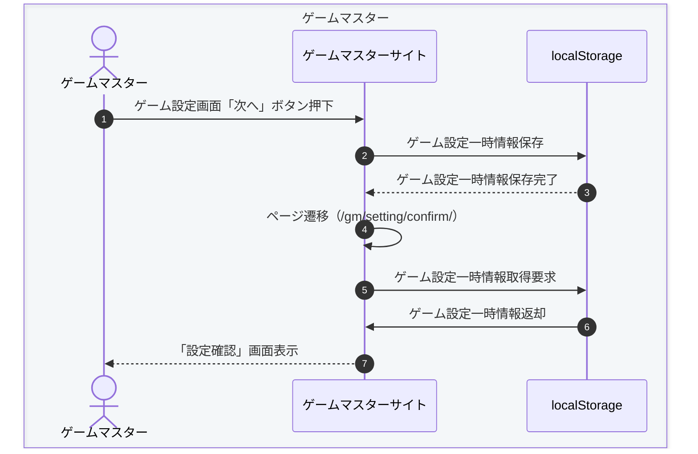
```mermaid
sequenceDiagram
    %% 定義
    box rgba(202, 237, 255, 0.1) ゲームマスター
        actor gm as ゲームマスター
        participant gms as ゲームマスターサイト
        participant gmls as localStorage
    end
    
    %% フロー記述
    autonumber
    gm ->> gms: ゲーム設定画面「次へ」ボタン押下
    gms ->> gmls: ゲーム設定一時情報保存
    gmls -->> gms: ゲーム設定一時情報保存完了
    gms ->> gms: ページ遷移（/gm/setting/confirm/）
    gms ->> gmls: ゲーム設定一時情報取得要求
    gmls ->> gms: ゲーム設定一時情報返却
    gms -->> gm: 「設定確認」画面表示
```

## 【PRAL003】ゲーム開始ボタン押下

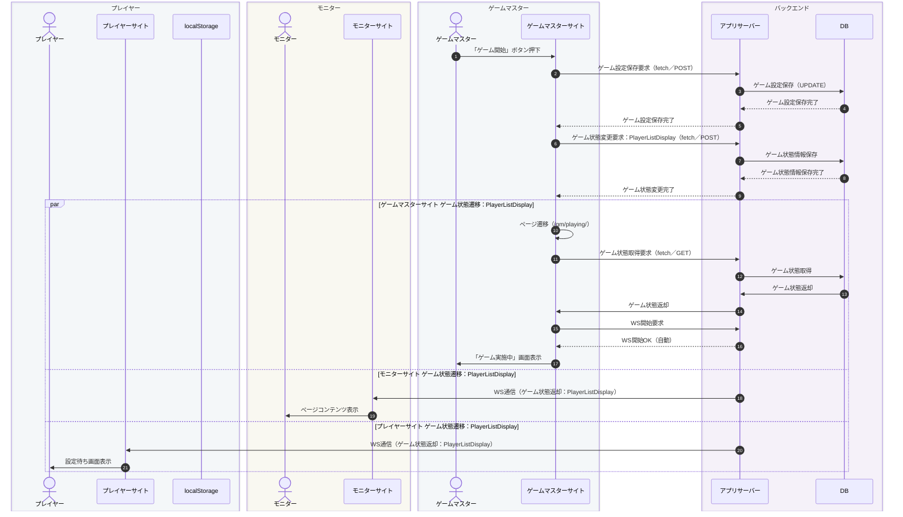
```mermaid
sequenceDiagram
    %% 定義
    box rgba(202, 237, 255, 0.1) プレイヤー
        actor pl as プレイヤー
        participant pls as プレイヤーサイト
        participant plls as localStorage
    end
    box rgba(251, 240, 178, 0.1) モニター
        actor mt as モニター
        participant mts as モニターサイト
    end
    box rgba(202, 237, 255, 0.1) ゲームマスター
        actor gm as ゲームマスター
        participant gms as ゲームマスターサイト
    end
    box rgba(216, 180, 248, 0.1) バックエンド
        participant sv as アプリサーバー
        participant db as DB
    end
    
    %% フロー記述
    autonumber
    gm ->> gms: 「ゲーム開始」ボタン押下
    gms ->> sv: ゲーム設定保存要求（fetch／POST）
    sv ->> db: ゲーム設定保存（UPDATE）
    db -->> sv: ゲーム設定保存完了
    sv -->> gms: ゲーム設定保存完了
    gms ->> sv: ゲーム状態変更要求：PlayerListDisplay（fetch／POST）
    sv ->> db: ゲーム状態情報保存
    db -->> sv: ゲーム状態情報保存完了
    sv -->> gms: ゲーム状態変更完了
    par ゲームマスターサイト ゲーム状態遷移：PlayerListDisplay
        gms ->> gms: ページ遷移（/gm/playing/）
        gms ->> sv: ゲーム状態取得要求（fetch／GET）
        sv ->> db: ゲーム状態取得
        db ->> sv: ゲーム状態返却
        sv ->> gms: ゲーム状態返却
        gms ->> sv: WS開始要求
        sv -->> gms: WS開始OK（自動）
        gms ->> gm: 「ゲーム実施中」画面表示
    and モニターサイト ゲーム状態遷移：PlayerListDisplay
        sv ->> mts: WS通信（ゲーム状態返却：PlayerListDisplay）
        mts ->> mt: ページコンテンツ表示
    and プレイヤーサイト ゲーム状態遷移：PlayerListDisplay
        sv ->> pls: WS通信（ゲーム状態返却：PlayerListDisplay）
        pls ->> pl: 設定待ち画面表示
    end
```

## 【PRAL004】役職決定画面遷移

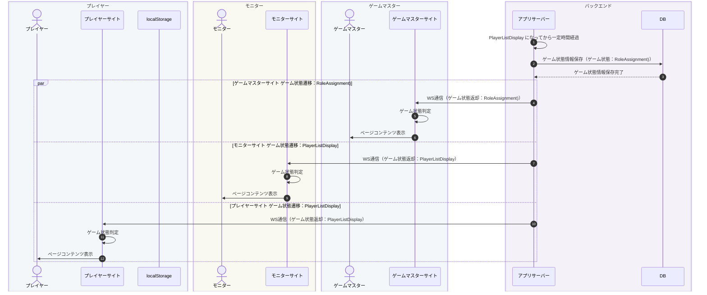
```mermaid
sequenceDiagram
    %% 定義
    box rgba(202, 237, 255, 0.1) プレイヤー
        actor pl as プレイヤー
        participant pls as プレイヤーサイト
        participant plls as localStorage
    end
    box rgba(251, 240, 178, 0.1) モニター
        actor mt as モニター
        participant mts as モニターサイト
    end
    box rgba(202, 237, 255, 0.1) ゲームマスター
        actor gm as ゲームマスター
        participant gms as ゲームマスターサイト
    end
    box rgba(216, 180, 248, 0.1) バックエンド
        participant sv as アプリサーバー
        participant db as DB
    end
    
    %% フロー記述
    autonumber
    sv ->> sv: PlayerListDisplay になってから一定時間経過
    sv ->> db: ゲーム状態情報保存（ゲーム状態：RoleAssignment)）
    db -->> sv: ゲーム状態情報保存完了
    par ゲームマスターサイト ゲーム状態遷移：RoleAssignment)
        sv ->> gms: WS通信（ゲーム状態返却：RoleAssignment)）
        gms ->> gms: ゲーム状態判定
        gms ->> gm: ページコンテンツ表示
    and モニターサイト ゲーム状態遷移：PlayerListDisplay
        sv ->> mts: WS通信（ゲーム状態返却：PlayerListDisplay）
        mts ->> mts: ゲーム状態判定
        mts ->> mt: ページコンテンツ表示
    and プレイヤーサイト ゲーム状態遷移：PlayerListDisplay
        sv ->> pls: WS通信（ゲーム状態返却：PlayerListDisplay）
        pls ->> pls: ゲーム状態判定
        pls ->> pl: ページコンテンツ表示
    end
```

